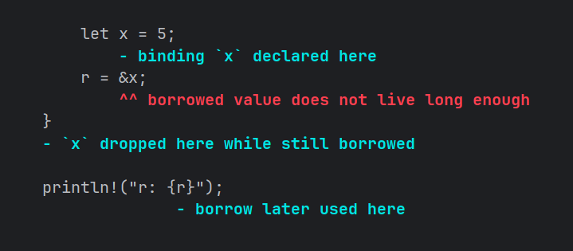
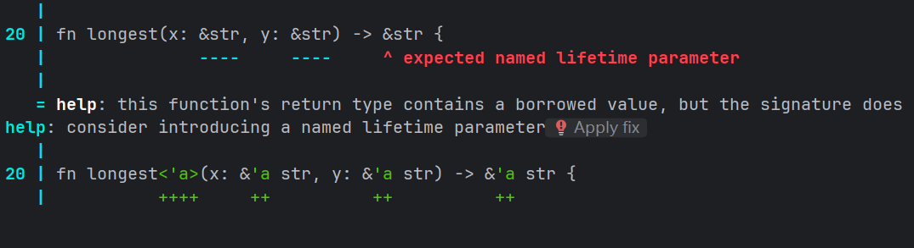

# Rust 生命周期

## 悬垂引用

生命周期是另一类我们已经使用过的泛型。

生命周期的主要目标是避免**悬垂引用**（*dangling references*），后者会导致程序引用了非预期引用的数据。

```rust
fn main() {
    let r;

    {
        let x = 5;
        r = &x;
    }

    println!("r: {r}");
}
```



我们将创建一个引用的行为称为 **借用**（*borrowing*）。  
Rust 编译器有一个**借用检查器**（*borrow checker*），它比较作用域来确保所有的借用都是有效的。

## 函数中的泛型生命周期

```rust
fn longest(x: &str, y: &str) -> &str {
    if x.len() > y.len() { x } else { y }
}
```



提示文本揭示了返回值需要一个泛型生命周期参数，因为 Rust 并不知道将要返回的引用是指向 `x` 或 `y`。

生命周期注解的语法：

```rust
&i32        // 引用
&'a i32     // 带有显式生命周期的引用
&'a mut i32 // 带有显式生命周期的可变引用
```

