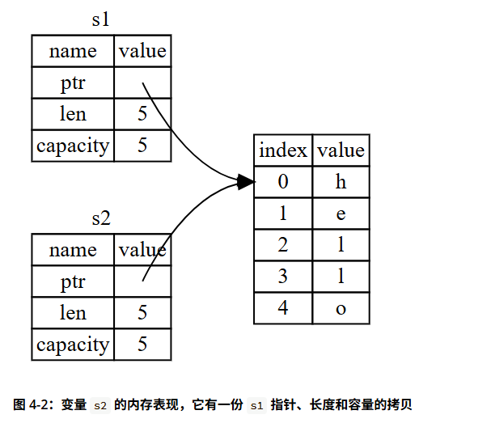

# Rust的所有权系统

所有权（ownership）是 Rust 用于如何管理内存的一组规则。</br>
Rust 则选择了第三种方式：通过所有权系统管理内存，编译器在编译时会根据一系列的规则进行检查。

> 栈和堆

## 所有权的规则

- Rust 中的每一个值都有一个 所有者（owner）。
- 值在任一时刻有且只有一个所有者。
- 当所有者离开作用域，这个值将被丢弃。

## 变量作用域

## 内存和分配

对于 String 类型，为了支持一个可变，可增长的文本片段，需要在堆上分配一块在编译时未知大小的内存来存放内容。这意味着：

- 必须在运行时向内存分配器（memory allocator）请求内存。
- 需要一个当我们处理完 String 时将内存返回给分配器的方法。

Rust 采取了一个不同的策略：内存在拥有它的变量离开作用域后就被自动释放。

```rust
    {
        let s = String::from("hello"); // 从此处起，s 是有效的

        // 使用 s
    }                                  // 此作用域已结束，
                                       // s 不再有效

```

这是一个将 String 需要的内存返回给分配器的很自然的位置：
当 s 离开作用域的时候。当变量离开作用域，Rust 为我们调用一个特殊的函数: `drop`

> 在 C++ 中，这种 item 在生命周期结束时释放资源的模式有时被称作 
> 资源获取即初始化（Resource Acquisition Is Initialization (RAII)）。

```rust
    let s1 = String::from("hello");
    let s2 = s1;
```

当我们将 s1 赋值给 s2，String 的数据被复制了，这意味着我们从栈上拷贝了它的指针、长度和容量。我们并没有复制指针指向的堆上数据。



为了确保内存安全，在 let s2 = s1; 之后，Rust 认为 s1 不再有效，因此 Rust 不需要在 s1 离开作用域后清理任何东西。</br>
因为 Rust 同时使第一个变量无效了，这个操作被称为 移动（move），而不是叫做浅拷贝。

```rust
let s1 = String::from("hello");
let s2 = s1.clone();

println!("s1 = {s1}, s2 = {s2}");


let x = 5;
let y = x;

println!("x = {x}, y = {y}");

```
整型数据存在“栈”上，且实现了 Copy 特型，赋值时会自动复制；
而 String 的数据存在“堆”上，没有实现 Copy 特型，赋值时会发生“所有权转移（Move）”。

在 Rust 中，赋值操作（let b = a;）的默认行为是 Move（移动）。
只有当类型实现了 Copy 特型时，赋值操作才会变成 Copy（复制）。

Rust 有一个叫做 `Copy` trait 的特殊注解，可以用在类似整型这样的存储在栈上的类型上。 
如果一个类型实现了 `Copy` trait，那么一个旧的变量在将其赋值给其他变量后仍然有效。

Rust 不允许自身或其任何部分实现了 `Drop` trait 的类型使用 `Copy` trait。

那么哪些类型实现了 Copy trait 呢?
- 所有整数类型，比如 u32。
- 布尔类型，bool，它的值是 true 和 false。
- 所有浮点数类型，比如 f64。
- 字符类型，char。
- 元组，当且仅当其包含的类型也都实现 Copy 的时候。

## 所有权和函数

