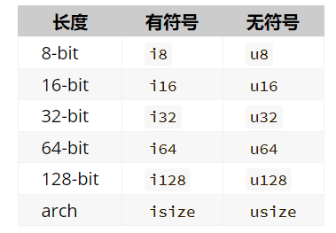

# Rust Started

## 数据类型



## Trait 是什么

trait 是 Rust 的接口（类似其他语言的 interface / protocol）。 </br>
核心作用：
- 定义共享行为（方法签名）
- 实现多态
- 做泛型约束（where 子句 / impl Trait）

```rust
trait Drawable {
    fn draw(&self);
}

impl Drawable for Circle { ... }
impl Drawable for Square { ... }

```

## 属性

属性（attribute）是关于 Rust 代码片段的元数据；